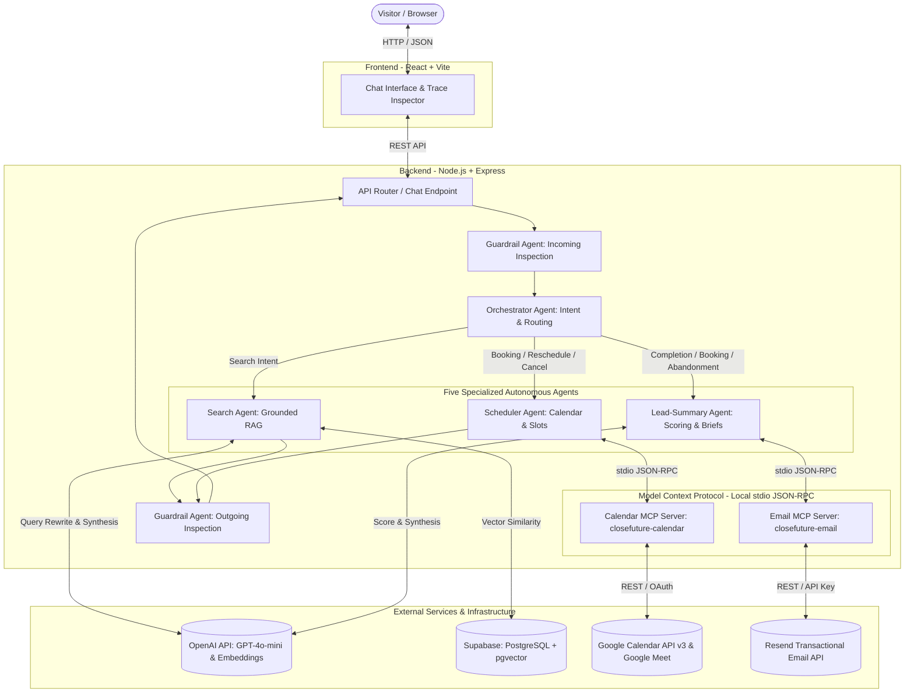

# CloseFuture AI Assistant

A multi-agent AI assistant case-study implementation designed for **CloseFuture**—an AI product studio that builds and launches web apps, mobile apps, and platforms in 4–6 weeks. The assistant provides prospective clients with grounded studio intelligence, multi-intent conversational understanding, autonomous Google Calendar discovery call scheduling with Google Meet links, automated lead qualification, and executive sales brief delivery via the Model Context Protocol (MCP).

All factual statements about CloseFuture are strictly grounded in the official CloseFuture Company Profile.

---

## 1. System Architecture



---

## 2. The Five Specialized Agents

1. **Orchestrator Agent** (`backend/src/agents/orchestrator.ts`):
   - Performs structured intent classification (`search`, `booking`, `reschedule`, `cancel`, `lead_summary`, `unknown`) with confidence scoring.
   - Manages multi-intent sequencing, executing compound workflows (e.g. capabilities query + meeting discovery) in a single turn.
   - Triggers low-confidence clarification dialog when intent is ambiguous without guessing.

2. **Search Agent** (`backend/src/agents/searchAgent.ts`):
   - Grounded strictly on the official CloseFuture Company Profile.
   - Performs contextual query rewriting using dialogue history for coreference resolution.
   - Executes vector similarity searches against 1536-dimensional embeddings in Supabase `pgvector` with an HNSW index.
   - Attaches page and section citations; returns an explicit `no_answer` fallback if information is not in the source knowledge.

3. **Scheduler Agent** (`backend/src/agents/schedulerAgent.ts`):
   - Interacts with a local Calendar MCP server over `stdio` JSON-RPC.
   - Retrieves live available slots (Monday–Friday, 09:00–18:00) adjusted to visitor timezones.
   - Enforces pre-booking collision checks, creates calendar events with Google Meet links and attendee invitations, and manages rescheduling and cancellations.

4. **Lead-Summary Agent** (`backend/src/agents/leadSummaryAgent.ts`):
   - Evaluates conversation history using a deterministic 100-point qualification rubric (High $\ge 80$, Medium $\ge 50$, Early $< 50$).
   - Formats and dispatches an executive HTML briefing to the internal sales inbox via a local Email MCP server.
   - Prevents duplicate dispatches using atomic two-phase session state claiming (`not_sent`/`failed` $\rightarrow$ `pending` $\rightarrow$ `sent`/`failed`) and native Resend SDK idempotency keys.
   - Operates on confirmed bookings, explicit visitor exits, and abandoned sessions.

5. **Guardrail Agent** (`backend/src/agents/guardrailAgent.ts`):
   - **Incoming**: Inspects visitor inputs to block prompt injection attacks, rule override attempts, and confidential PII probes.
   - **Outgoing**: Validates generated candidate responses to prevent unauthorized timeline guarantees, unsupported pricing commitments, or hallucinations.

---

## 3. Core Infrastructure & Technologies

- **Frontend**: React, Vite, TypeScript, Vanilla CSS.
- **Backend**: Node.js, Express, TypeScript (ES modules).
- **LLM & Embeddings**: OpenAI API (`gpt-4o-mini`, `text-embedding-3-small`).
- **Database & Storage**: Supabase, PostgreSQL, `pgvector` extension, Row Level Security.
- **Protocol**: Anthropic Model Context Protocol (MCP) TypeScript SDK (`@modelcontextprotocol/sdk`).
- **Scheduling**: Google Calendar API v3, Google Meet conference integration.
- **Email Delivery**: Resend transactional email API.

---

## 4. Key Workflows

### Grounded RAG Flow
1. Visitor submits inquiry $\rightarrow$ Incoming Guardrail inspects input.
2. Search Agent rewrites prompt incorporating session history for pronoun/contextual resolution.
3. Embedding generated (`text-embedding-3-small`) and matched against Supabase knowledge chunks via cosine similarity.
4. Top chunks compiled with page/section citations; candidate answer synthesized.
5. Outgoing Guardrail checks groundedness before delivering response with citation chips.

### Calendar Booking Flow
1. Visitor requests discovery call $\rightarrow$ Scheduler Agent calls Calendar MCP tool `get_available_slots`.
2. Interactive slot cards rendered in visitor timezone (e.g. `Mon, Sep 21, 9:30 AM – 10:00 AM (GMT+5:30)`).
3. Visitor selects slot and provides email address.
4. Pre-booking atomic check verifies slot is still free.
5. Calendar MCP tool `book_discovery_call` creates the event in Google Calendar, injects Google Meet conference details, and invites the attendee.
6. Confirmation card displayed with a live `📹 Join Google Meet` link.

### Lead-Summary & Sales Notification Flow
1. Booking confirmation, explicit completion ("That's all, thanks"), or session abandonment triggers lead evaluation.
2. Dialogue evaluated against 5 criteria: problem clarity (20), budget (20), timeline (20), technical fit (20), contact completeness (20).
3. Session atomically transitioned to `pending` to prevent race conditions across concurrent triggers.
4. Local Email MCP server called with Resend idempotency key (`lead-summary/<sessionId>/v<version>`).
5. Executive HTML briefing delivered to sales inbox; session marked `sent`.

---

## 5. Security & Privacy Guarantees

- **Credential Protection**: API keys (`OPENAI_API_KEY`, `RESEND_API_KEY`, `SUPABASE_SECRET_KEY`), OAuth tokens (`tokens.json`), and client secrets (`credentials.json`) are strictly kept on the server and are excluded from version control.
- **Client Sanitization**: The session recovery endpoint (`GET /api/sessions/:sessionId`) strictly conceals internal data (`lead_score`, `qualification_tier`, `booked_event_id`, `summary_status`). Only sanitized messages and a boolean `hasBooking` flag are returned.
- **Trace Sanitization**: The Developer Trace Inspector displays safe execution metadata (stage name, latency, intent, confidence) without exposing raw system prompts, provider secrets, or database connection strings.

---

## 6. Local Setup & Installation

### Backend Setup
```powershell
cd backend
npm install
npm run dev
```
Backend runs at `http://localhost:4000`.

### Frontend Setup
```powershell
cd frontend
npm install
npm run dev
```
Frontend runs at `http://localhost:5173`.

---

## 7. Required Environment Variables

### Backend (`backend/.env`)
Set the following environment variable names (do not commit real secrets):
- `OPENAI_API_KEY`: Secret key for OpenAI models and embeddings.
- `OPENAI_MODEL`: Chat model name (`gpt-4o-mini`).
- `SUPABASE_URL`: HTTPS URL of the Supabase project.
- `SUPABASE_SECRET_KEY`: Service role secret key for database operations.
- `PORT`: HTTP port for Express server (`4000`).
- `RESEND_API_KEY`: Secret API key for Resend email service.
- `RESEND_FROM_EMAIL`: Sender address (`CloseFuture AI <onboarding@resend.dev>`).
- `SALES_EMAIL`: Internal destination email address for lead summaries.
- `APP_BASE_URL`: Frontend web address (`http://localhost:5173`).

### Frontend (`frontend/.env`)
- `VITE_API_BASE_URL`: Backend endpoint (`http://localhost:4000`).

### Google Calendar Credentials
- `backend/credentials.json`: Google Cloud Desktop OAuth client secrets.
- `backend/tokens.json`: Generated token storage created via `npm run auth:calendar`.

---

## 8. Final Test Commands

Execute all test suites sequentially from the root or `backend` folder:

```powershell
# 1. Typecheck Backend
cd backend
npx tsc --noEmit

# 2. Search Agent & RAG Retrieval Test Suite (6/6 passing)
npx tsx src/agents/testSearchAgent.ts

# 3. Orchestrator & Guardrails Test Suite (7/7 passing)
npx tsx src/agents/testOrchestrator.ts

# 4. Scheduler Agent & Google Calendar MCP Test Suite (16/16 passing)
npx tsx src/agents/testSchedulerAgent.ts

# 5. Lead-Summary Agent & Email MCP Test Suite (9/9 passing)
npx tsx src/agents/testLeadSummaryAgent.ts

# 6. Session Persistence & Restore Test Suite (5/5 passing)
npx tsx src/tests/testSessionRestore.ts

# 7. Browser Reload Flow Test Suite (7/7 passing)
npx tsx src/tests/testBrowserReloadFlow.ts

# 8. Full End-to-End A–J Flow Test Suite (10/10 passing)
npx tsx src/tests/testFullFrontendFlow.ts

# 9. Frontend Production Build
cd ../frontend
npm run build
```

---

## 9. Case Study Verification

The CloseFuture AI Assistant case-study implementation has completed end-to-end automated and real-browser verification:

- **Search Agent**: **6 / 6 PASSED**
- **Orchestrator & Guardrail**: **7 / 7 PASSED**
- **Scheduler & Calendar MCP**: **16 / 16 PASSED**
- **Lead-Summary & Email MCP**: **9 / 9 PASSED**
- **Session Restore**: **5 / 5 PASSED**
- **Browser Reload**: **7 / 7 PASSED**
- **End-to-End**: **10 / 10 PASSED**

### Real Google Calendar Verification
The Google Calendar scheduling integration was tested with real API requests:
- Real availability query against working hours (09:00–18:00) with timezone conversion.
- Real event creation on Google Calendar.
- Automatic Google Meet video conference link generation (`meet.google.com`).
- Real attendee calendar invite delivery.
- In-place rescheduling preserving the existing `eventId`.
- Event cancellation removing the booking from Google Calendar.

### Grounding & Scope Note
All information regarding CloseFuture's studio capabilities, services, delivery timelines, pricing structure, and portfolio work (Dipy, Liya AI, Galaxy Move, Randevmeste, Vigo, Webiz) is strictly grounded in the provided CloseFuture Company Profile. This repository represents a comprehensive case-study implementation designed to demonstrate multi-agent orchestration, MCP integration, and conversational UX boundaries.

---

## 10. Documentation Index

- [Acceptance Matrix](file:///e:/Internship/INTERN/closefuture-agent/docs/acceptance-matrix.md): Verification table mapping all 21 requirements to test sources and PASS statuses.
- [Final Verification Record](file:///e:/Internship/INTERN/closefuture-agent/docs/final-verification.md): Log of all test runs and verification results.
- [Evaluator Demo Guide](file:///e:/Internship/INTERN/closefuture-agent/docs/demo-guide.md): Step-by-step walkthrough, test prompts, and failure handling.
- [Search Agent Specification](file:///e:/Internship/INTERN/closefuture-agent/docs/search-agent.md): In-depth documentation on RAG retrieval, embeddings, chunking, and fallback logic.
- [Orchestrator & Guardrail Specification](file:///e:/Internship/INTERN/closefuture-agent/docs/orchestrator-guardrail.md): Intent classification, multi-intent sequencing, and guardrails.
- [Scheduler & Calendar MCP Specification](file:///e:/Internship/INTERN/closefuture-agent/docs/scheduler-mcp.md): MCP protocol details, Calendar tools, and Google Meet integration.
- [Lead-Summary & Email MCP Specification](file:///e:/Internship/INTERN/closefuture-agent/docs/lead-summary-email.md): Scoring rubric, Resend integration, and concurrency protection.
